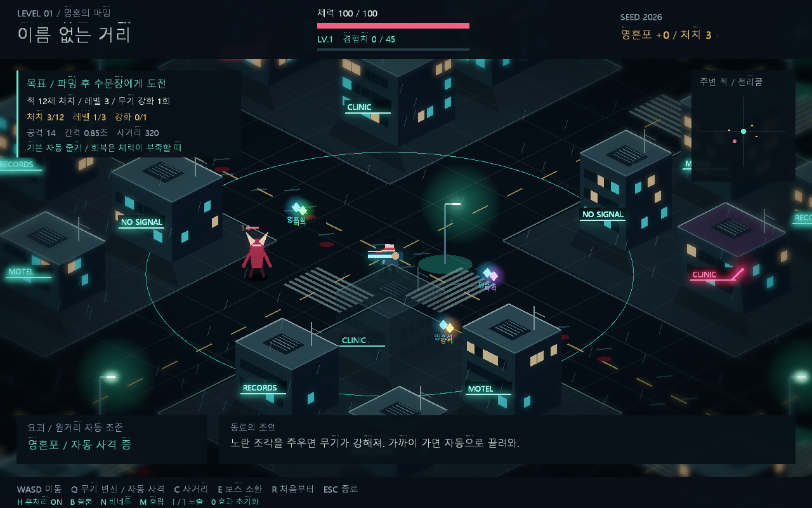
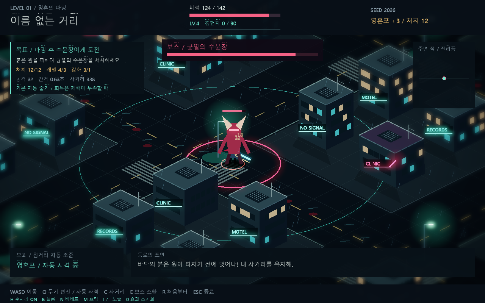

# 2026GSE01

## 2026-09-14 레벨 1 — 파밍과 첫 보스

C++ / OpenGL 3.3 기반 2.5D 도시 탐험 데모입니다.
`SimpleGame.sln`에서 **x64 / Debug** 또는 **x64 / Release**를 빌드해 실행합니다.

- WASD: 이동, Q: 원거리 무기 변신 / 자동 조준·사격, C: 사거리 표시
- E: 조건 달성 후 균열에서 보스 소환, R: 재시작
- 경험치 성장, 강화·회복·영혼석·자석 드랍, 랜덤 연결 도로, 보스 전투
- HDR 후처리: H 전체 전환, B 블룸, N 비네트, M 가장자리 흐림, [ / ] 노출

[레벨 1 조작·밸런스·검증 안내](LEVEL1.md)

[메시 캐시·독립 셰이더 구성 및 배포 안내](RENDERING.md)

AI 대화, 영구 융합 및 저장은 후속 구현 예정입니다.
