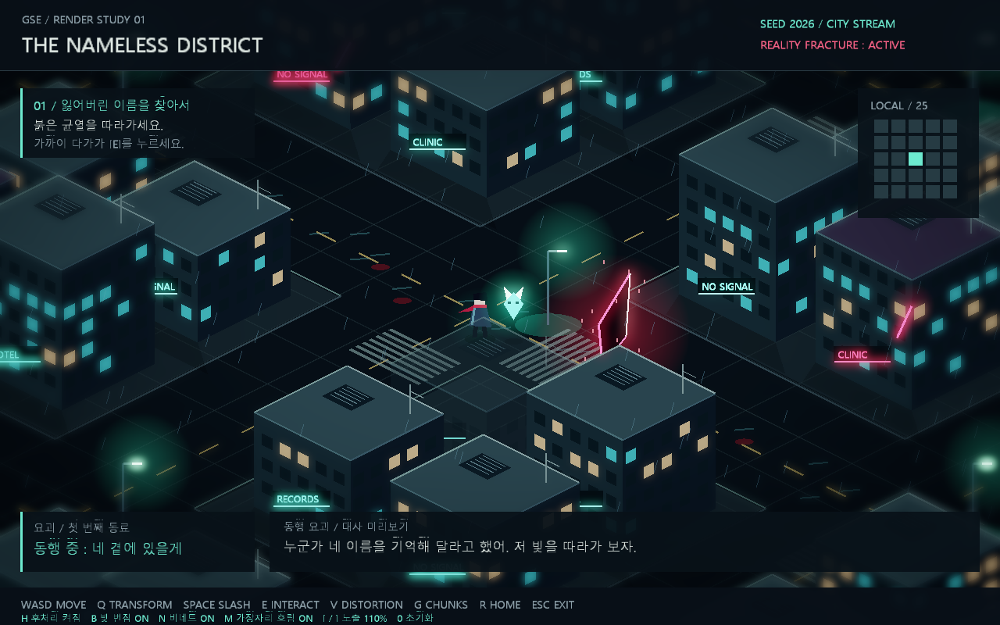
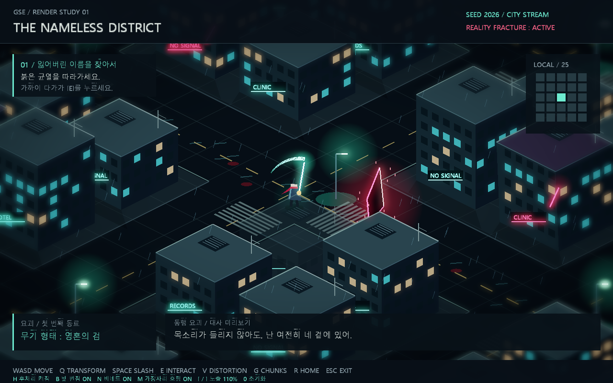

# 2026GSE01

## 2026-09-11 렌더링 프로토타입

C++ / OpenGL 3.3 기반 2.5D 도시 탐험 데모입니다.
`SimpleGame.sln`에서 **x64 / Debug** 또는 **x64 / Release**를 빌드해 실행합니다.

- WASD: 이동, Q: 요괴의 무기 변신, Space: 공격 연출
- E: 균열 근처 기억 회수, V: 왜곡 전환, G: 청크 표시, R: 시작 위치
- 5×5 청크 스트리밍, 건물 충돌, 동행 요괴와 검 형태
- HDR 후처리: H 전체 전환, B 블룸, N 비네트, M 가장자리 흐림, [ / ] 노출

[실행·조작·구현 범위 및 검증 안내](PROTOTYPE.md)

AI 대화, 영구 융합, 적과의 전투 및 저장은 후속 구현 예정입니다.
